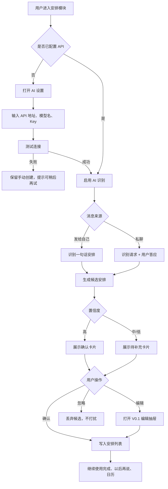

# Arrangements V0.2 AI Recognition Plan

## 目标

V0.2 只建立 AI 识别安排的最小可用闭环：用户可以绑定自己的大模型 API，在“发给自己”和一个明确的私聊请求场景中识别安排，经过确认后写入现有安排列表。

V0.2 不追求全自动、全场景覆盖。它的核心价值是验证三件事：

- AI 能否从真实对话里提出“尚未发生但需要后续执行”的安排。
- 用户是否愿意接受“先预览、再确认”的低风险创建方式。
- AI 创建出的安排是否能自然接入 V0.1 的手动编辑、完成、以后再说、日历和持久化能力。

## 范围边界

### 本版本包含

- 用户自备 API 配置入口。
- API 可用性检查和基础错误提示。
- “发给自己”消息识别安排。
- 私聊中“对方提出请求，用户明确答应”的早餐类场景。
- AI 识别结果预览卡片。
- 用户确认、编辑或忽略 AI 候选安排。
- 候选安排确认后复用 V0.1 的安排数据结构保存。
- 在安排详情中记录来源对话摘要。

### 本版本暂缓

- 群聊安排识别。
- 多人上下文归集合并。
- 多物品长链路连续对话识别。
- 智能完成。
- AI 自动执行任务。
- 无确认的静默创建。
- 服务端同步和多端密钥托管。

## 用户流程



## 功能设计

### 1. AI 设置

入口放在安排模块的次级入口，不抢占主流程。用户未配置 API 时，手动创建仍然完整可用。

字段建议：

- API Base URL
- API Key
- 模型名
- 识别开关
- 连接测试按钮
- 费用提醒文案

数据行为：

- V0.2 Demo 可先使用 localStorage 保存配置。
- API Key 在 UI 中默认隐藏，只显示是否已配置。
- 连接失败不阻断安排模块，只关闭 AI 识别能力。
- 明确提示“将消耗你自己的模型 token”。

### 2. 发给自己识别

典型输入：

```text
后天去一趟医院
```

候选输出：

- title: 后天去一趟医院
- timeMode: deadline
- deadlineAt: 后天的合理时间，若无具体时间则要求用户确认
- people: 自己
- place: 医院
- sourceType: selfMessage
- confidence: high / medium / low

交互策略：

- 识别后不直接入库，先生成候选卡片。
- 时间不完整时显示“需要补时间”，点击进入编辑抽屉。
- 用户确认后才写入 V0.1 安排列表。

### 3. 私聊早餐场景

典型上下文：

```text
对方：明天帮我带早餐
我：好的
```

当前用户候选安排：

- title: 明天帮对方带早餐
- people: 对方
- timeMode: deadline
- deadlineAt: 明天上午，具体时间待确认
- sourceType: privateChat
- sourceSummary: 对方请求带早餐，用户已答应

对方视角的镜像安排暂不落到本机 Demo，只在设计上保留字段能力。V0.2 先服务当前用户，避免过早引入跨账号同步。

### 4. 候选安排预览

候选卡片只承担一个目的：让用户快速判断“要不要把它变成安排”。

卡片信息：

- 标题
- 提取到的人、时间、地点
- 来源：发给自己 / 私聊
- 置信度提示
- 操作：确认、编辑、忽略

低置信度候选不强调“AI 错了”，只温和提示“有些信息还不完整”。这与安排模块的低压哲学一致。

### 5. 数据结构扩展建议

在不破坏 V0.1 `Arrangement` 的前提下新增来源字段：

```ts
type ArrangementSource = {
  sourceType: "manual" | "selfMessage" | "privateChat";
  sourceId: string | null;
  sourceSummary: string;
  rawContext: string[];
  confidence: "high" | "medium" | "low";
  createdBy: "user" | "aiCandidate";
};
```

V0.2 可以先把来源信息放进 `notes` 或扩展字段中。若扩展 `Arrangement` 类型，必须补齐 store normalize 兼容逻辑，避免旧数据失效。

## 判断逻辑

### 可以生成候选的条件

- 句子包含未来动作或未完成承诺。
- 能提取到至少一个行动目标。
- 对当前用户有明确责任关系。
- 私聊场景中必须存在用户接受信号，如“好”“可以”“没问题”“我来”。

### 需要补充的条件

- 有动作但时间缺失。
- 时间是模糊表达，如“哪天”“回头”“有空”。
- 主语或责任人不清楚。
- 地点可能是普通名词，也可能是具体地点。

### 不生成候选的条件

- 只是闲聊、回忆、已经完成的事。
- 只是愿望，没有后续执行责任。
- 用户没有答应对方请求。
- 置信度低且缺少必要动作目标。

## 验证场景

### 正向场景

- 发给自己“后天去一趟医院”，出现候选安排，确认后进入近期。
- 发给自己“明天下午 3 点去公司拿资料”，候选包含时间和地点。
- 私聊“明天帮我带早餐 / 好的”，候选标题为“明天帮对方带早餐”。
- 候选安排确认后可继续编辑、完成、以后再说、删除。

### 兜底场景

- “～～”不生成 AI 候选，但手动创建入口仍可用。
- “有空去游泳”生成待补充候选或不生成，不能直接入库。
- API 连接失败时，页面不崩溃，手动安排不受影响。
- API Key 为空时，不发起识别请求。

## 开发切片

### Slice 1: AI 设置和配置状态

Status 2026-05-17: implemented. The app now has a lightweight AI settings entry, localStorage-backed API Base URL / model / API Key / enable state, local completeness-test feedback, and an AI configured/unconfigured status pill. No real recognition or model request is connected in this slice.

- 新增 AI 设置抽屉或页面片段。
- 保存 API Base URL、模型名、Key 是否已配置。
- 增加连接测试的成功、失败、加载状态。
- 不接入真实识别逻辑。

### Slice 2: 候选安排数据模型

Status 2026-05-17: implemented. Added a local AI candidate model, pending candidate persistence, preview cards, confirm/edit/ignore actions, and a tiny local demo candidate trigger. This slice still does not call a real model.

- 新增 AI 候选类型和本地候选状态。
- 候选卡片支持确认、编辑、忽略。
- 确认后复用 V0.1 `handleCreate` 或等价保存流程。

### Slice 3: 发给自己识别

Status 2026-05-17: implemented. Added a lightweight self-message recognition card on the arrangements page, a local rule-based recognizer for the first V0.2 demo path, and tests that verify self messages become AI candidates only. This slice still does not call a real model and still requires user confirmation before saving.

Status 2026-05-18: real AI API path connected. When AI settings are configured and enabled, self-message recognition first calls an OpenAI-compatible `chat/completions` endpoint with the configured Base URL, model, and API Key. Model output is normalized into the existing pending candidate model. If the request fails, returns non-JSON, or says no arrangement, the local recognizer remains the fallback. The result still only becomes a candidate and never creates a formal arrangement without user confirmation.

- 新增一个本地消息输入测试入口。
- 调用模型解析一句话安排。
- 高置信度显示确认卡片，中低置信度显示待补充卡片。

### Slice 4: 私聊请求识别

Status 2026-05-17: implemented. Added the first private-chat recognition path for `对方：明天帮我带早餐 / 我：好的`. It creates a pending AI candidate only, does not show explicit recognition copy in the chat window, and marks the triggering message with a subtle green background ripple at the bottom edge of the bubble. Follow-up fixes: existing accepted chat history is now backfilled on app load/message refresh, the arrangements page listens for AI candidate store updates, accepted/dismissed candidates are not revived by later backfill scans, and already-existing private-chat candidates can now backfill the visual recognition state onto the matching source bubble. The final feedback layer lives outside the bubble as a chat-background ripple: the bubble keeps its normal surface color, the ripple stays close to the bubble bottom, and the animation fades to opacity 0 after completion.

Status 2026-05-18: broadened from the single breakfast sample into a low-cost local recognition frame. The recognizer now requires three signals before creating a pending candidate: the other person transfers responsibility to the current user, the message contains an executable objective, and the user reply is an acceptance or commitment rather than a refusal or follow-up question. It supports different request orders such as `明天下午3点帮我去公司拿资料`, `资料明天下午3点能不能帮我去公司拿一下`, and `你明天下午3点去公司帮我拿资料可以吗`; multi-item requests such as `后天帮我买牛奶、面包和鸡蛋` are merged into one candidate with item notes. This remains local rule-based V0.2 logic, not a real model call.

Status 2026-05-18: real AI API path connected for new private-chat replies. The app still creates a local fallback candidate immediately when the low-cost recognizer is confident, then asynchronously calls the configured OpenAI-compatible endpoint to refine or replace that pending candidate using the same stable source-message candidate ID. Historical backfill stays local to avoid unexpected token use. Chat feedback remains implicit: no explicit recognition copy, only the existing subtle visual feedback on the source bubble.

- 新增私聊上下文样例输入。
- 识别“对方请求 + 用户接受或承诺”。
- 生成当前用户安排，不做对方账号同步。

### Slice 5: 体验收口

Status 2026-05-17: in progress. First closure pass adds explicit time visibility on AI candidate cards: extracted deadlines/ranges are shown before confirmation, candidates without extracted time are marked as needing time completion, their edit action is labeled `补时间`, and the bottom `安排` tab shows a quiet pending-candidate count badge when chat recognition creates candidates outside the arrangements page.

Status 2026-05-18: completed for V0.2. The AI settings sheet now performs a real OpenAI-compatible connection test instead of only checking local field completeness. Success confirms the configured endpoint can be reached; failure uses low-pressure copy and leaves manual creation plus local recognition available. The settings copy now explicitly says Chat Completions, current-browser storage, token usage, and candidate-only behavior.

- 补全错误提示、空状态、加载态。
- 补充测试覆盖。
- 更新开发日志和验证清单。
- 决定 V0.3 是否进入群聊或归集合并。

## V0.2 成功标准

- 手动安排能力不回退。
- AI 失败时不影响手动创建。
- 用户能清楚知道 AI 只是提出候选，不是强制创建。
- 至少两个核心识别场景可验证。
- 所有 AI 候选都能在确认前编辑。
- 低置信度内容不会悄悄进入安排列表。

## 风险与建议

- 中文自然语言时间解析是风险点。建议 V0.2 不追求完全准确，凡是不确定的时间都进入“待补充”。
- API 兼容性是风险点。建议先抽象一个很薄的 `AiArrangementClient`，不要把 OpenAI 兼容格式写死在 UI 组件里。
- 误创建会伤害信任。建议默认“候选确认制”，至少到 V0.3 前都不做静默创建。
- 隐私感知很重要。建议在 AI 设置处清楚说明哪些文本会发送给模型。
- 归集合并很诱人，但不适合 V0.2。建议先把来源上下文记录好，为 V0.3 合并做数据准备。
